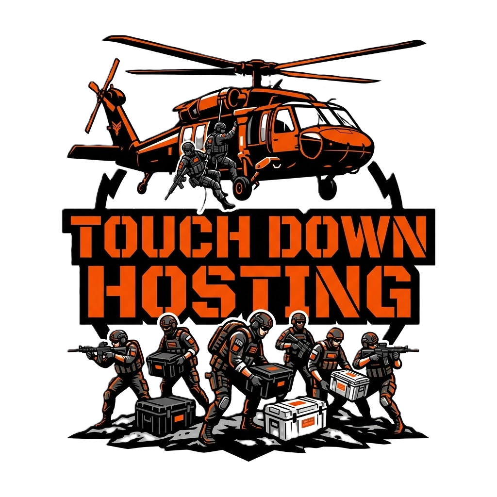

<p align="center">
    
</p>

<h1 align="center">Touch Down Hosting — Panel</h1>

<p align="center">
    The custom game server control panel powering <strong>Touch Down Hosting</strong> —
    black, white and orange with a signature glass-morphism finish.
    A heavily customized fork of <a href="https://pterodactyl.io">Pterodactyl Panel 1.14.1</a>.
</p>

---

## Features

Everything Pterodactyl does, plus the Touch Down Hosting experience:

- **Full glass-morphism reskin** — black/white/orange design system across the entire panel, admin area included
- **Trophy & EXP system** — 50 trophies across Bronze / Silver / Gold / Platinum tiers, earned for everyday panel actions, with toast notifications and level/EXP progression
- **Theming system** — four built-in themes (Cool Orange, Cool Blue Ocean, Cool Green Mint, Cool Silk Purple) plus unlimited custom `.json` themes dropped into `public/themes/` — no rebuild needed
- **Redesigned login** — glass login card, pulsating logo splash sequence, "Save my login for 30 days" remember-me
- **Services & Billing tab** — Stripe/PayPal key configuration (encrypted at rest), draggable pricing cards, OFF-by-default enable switch
- **Dev-Blogs & public roadmap** — hardcoded, externally-edited update feed with a Current Build card and To-Do roadmap
- **Storage attach** *(dev build)* — register extra disks, cloud volumes (Linode, Hetzner, OVH, DigitalOcean), NAS systems (HexOS, TrueNAS, OpenMediaVault, CasaOS, Unraid) and Windows SMB shares with one command or a few clicks
- **Master admin password reset** — `reset-master-password.sh` in the panel root; strong password policy enforced everywhere
- **Discord support button** — on every auth screen and in account settings

## Build channels

| Channel | Branch | Purpose | Updates |
| --- | --- | --- | --- |
| `public` | `main` | Customer-facing **Alpha** build | Manual |
| `dev` | `dev` | Internal build with dev-only features (Dev Lab, Storage) | Manual (auto-update available via opt-in) |

The version badge in the panel's navigation bar shows the active channel and build; clicking it opens the Dev-Blogs page.

## Installation

Automated installers for Ubuntu 22.04/24.04 and Debian 11/12 live in [`installer/`](installer/README.md):

```bash
git clone <your-repo-url> /tmp/tdh
bash /tmp/tdh/installer/install-touchdown-panel.sh
```

The installer handles PHP 8.3, MariaDB, Redis, nginx, Node.js 22 asset builds, Let's Encrypt, the queue worker and cron. Updating is one command: `bash installer/update-touchdown-panel.sh`.

**Prefer containers?** A full Docker / Docker Compose install (panel + MariaDB +
Redis, image built from your clone) is documented in [DOCKER.md](DOCKER.md).

Wings (the game server daemon) is unmodified in this fork — install it with the official tooling: <https://pterodactyl-installer.se>

## Customizing

- **Themes**: drop a `.json` file into `public/themes/` (see the built-in themes for the format)
- **Dev-Blog posts / roadmap**: edit `resources/scripts/touchdown/devblogs.ts` / `roadmap.ts`, then rebuild assets
- **Trophies**: add entries to `app/Services/Touchdown/TrophyRegistry.php` — no database changes required
- **Logo**: replace `public/logo.png` — it auto-sizes everywhere it appears

## Credits & License

Built on [Pterodactyl Panel](https://pterodactyl.io) — © 2015–present Pterodactyl Software, released under the [MIT License](LICENSE.md). All Touch Down Hosting modifications are provided under the same license. This project is not affiliated with or endorsed by Pterodactyl Software.
